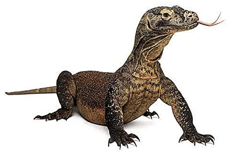

```{r setup, include = FALSE}

library(rmarkdown)
library(xaringan)
library(xaringanExtra)
library(knitr)
library(icons)
library(emo)
library(lattice)
require(phylopath)
require(ggplot2)
require(gridExtra)
require(grid)
require(ggraph)
require(phylolm)

## preset code chunk options

knitr::opts_chunk$set(dpi = 300,            # ensures high resolution images
                      echo = FALSE,         # FALSE: code chunks don't show
                      warning = FALSE,      # FALSE: suppresses warning messages
                      error = FALSE,       # FALSE: Suppresses error messages
                      fig.align = "center")

```


***

## Outline

- Chapter 1: Macroclimatic and maternal effects on the evolution of reproductive traits in lizards

- Chapter 2: The correlated evolution of foraging mode and reproductive effort in lizards

- Chapter 3: Geographic and seasonal variation of the *for* gene reveal signatures of local adaptation in *Drosophila melanogaster*

- Chapter 4: Foraging actively can be advantageous in heterogeneous environments


# Chapter 1:


***

## What is life history theory?

\begincols
  \begincol{.48\textwidth}

\justifying

{#id .class width=60% height=80%}
{#id .class width=70% height=70%}
<br><br>
  \endcol
\begincol{.48\textwidth}

\justifying

{#id .class width=80% height=70%}


  \endcol
\endcols

***

## Optimal reproductive tactics

```{r, out.width="225px", fig.align = "center"}


```
